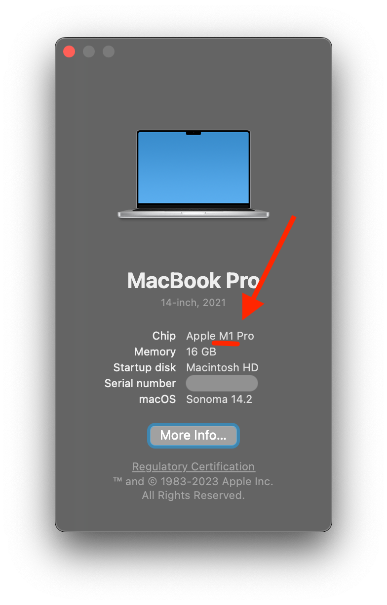
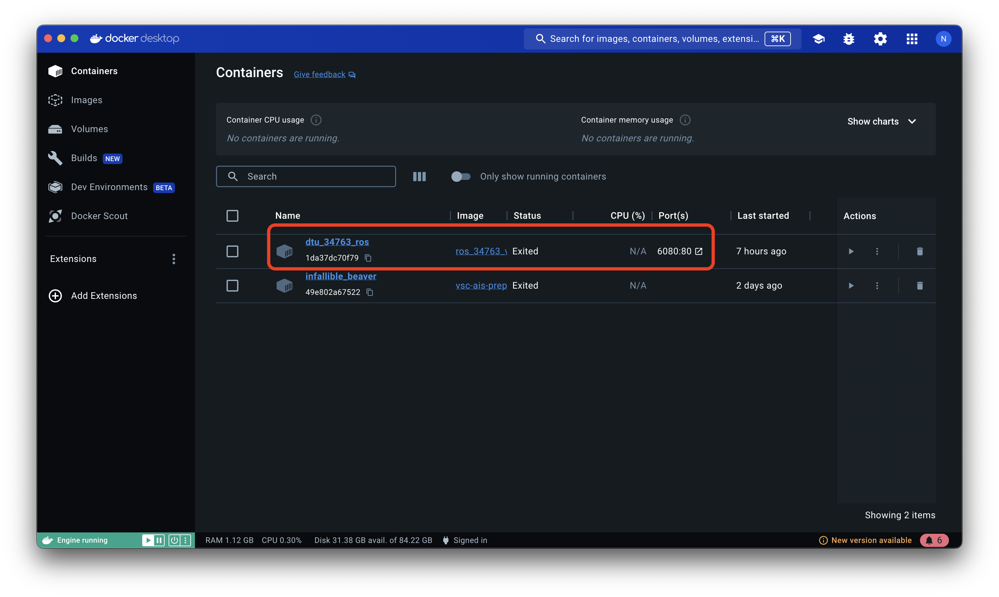

# 34763 - Autonomous Marine Robotics

This is the main repo for the DTU course 34763 Autonomous Marine Robotics.

The repository is structured as follows:


    ├── .gitignore         <- ignore file for git, ensures that we only store files we care about
    ├── Dockerfile         <- Dockerfile which contains a ROS noetic installation and included BlueROV software
    ├── README.md          <- The top-level README for developers using this project.
    │
    ├── media/             <- Contains pretty pictures for the README.md
    |
    ├── ros_ws/            <- Main folder for the ROS packages used in the course
    │   └── src/ (*)            
    │       ├── uuv_simulator  <- Underwater simulator package
    │       ├── bluerov2       <- Main ROS package for the BlueROV, contains the controllers, transforms, etc.
    │       └── bluerov2_gazebo <- BlueROV Gazebo packages
    │
    ├── scripts/           <- General scripts
    │   ├── build_and_create_docker.sh  <- Builds the image and creates a container
    |   ├── get_course_updates.sh       <- Downloads the latest changes from course respository
    |   ├── save_my_changes.sh          <- Uploads changes to personal fork (optional)
    │   └── start_container.sh          <- Starts the container
    │
    └── Training_Sessions/ (*)   <- Folders of exercise material for each lecture, and the exercise manual in a README.md
        ├── TS1
        ├── TS2
        ├── ...
        └── TS8

The folders marked with `(*)` are synced between your host machine (your laptop) and the docker container.


## Getting started 

First of all download or clone this repository to your own machine.

To get started, this guide will cover the following steps:

1. [Installing Docker and build Container](#getting-started-with-ros-docker-image)
2. [Starting the container](#starting-the-docker-container)
3. [Updating the course material](#getting-course-updates)
3. [Saving your changes in Gitlab](#backup-your-changes) (Optional)

### Docker Installation:
Before building the ROS Docker image, make sure you have Docker installed on your system. If not, follow the instructions below to install Docker:


1. **Linux:**
   - Follow the instructions on the [official Docker website](https://docs.docker.com/desktop/install/linux-install/) to install Docker on Linux.

2. **Windows:**
   - Download and install Docker Desktop from the [official Docker website](https://docs.docker.com/desktop/install/windows-install/).

3. **Mac:**
   - Download and install Docker Desktop from the [official Docker website](https://docs.docker.com/desktop/install/mac-install/).


### Creating the Docker container

Now we will create a docker container that will be used throughout the course, i.e., it will/should persist (live) untill you are done with the course.
However, the container can be started and stopped whenever you wish, and all your progress will be saved, so long you do not delete the container (this is why we created a fork before, we have our own personal backup!).

Open a terminal and navigate to the root folder of the cloned repository:

```bash
   cd 34763-autonomous-marine-robotics/
```

Now we need to
   1. Build the docker image (takes a while)
   2. Create a container based on the built image

To build the Docker image and create the container

#### Building on Windows

Open a `powershell` terminal and run

```bash
sh ./scripts/build_and_create_docker.sh

```

#### Building on Linux

Open a terminal and run the following command:

```bash
./scripts/build_and_create_docker.sh
```

If you get `permission denied` error, use `sudo` as such

```bash
sudo ./scripts/build_and_create_docker.sh
```

#### Building on MacOS

First check if your machine is equipped witha M-based processor, you can do this by clicking the apple logo -> about this mac.
If your `Chip` contains the word `M1/2/3`, you have an M-based (arm) processor.



For M-based machines, you need to run the following command
Open a terminal and run the following command:

```bash
./scripts/build_and_create_docker_m1.sh
```

Otherwise, run the standard script.

```bash
./scripts/build_and_create_docker.sh
```

If you get `permission denied` error, use `sudo` as such

```bash
sudo ./scripts/build_and_create_docker.sh
```

Now you can verify that the container exists by running `docker container list --all` and it should produce something like:

```bash
$ docker container list --all
CONTAINER ID   IMAGE             COMMAND             CREATED        STATUS                     PORTS     NAMES
1da37dc70f79   ros_34763_v_1     "/startup.sh"       9 hours ago    Exited (0) 7 minutes ago             dtu_34763_ros
```

or if you have Docker Desktop, you should see something like




### Starting the Docker container

Depending on your installation you can start the container is a few ways

#### Without Docker Desktop
To run the Docker container and access it through VNC, execute the following command:

```bash
./scripts/start_container.sh
```
If you get `permission denied` error, use `sudo` as such
```bash
sudo ./scripts/start_container.sh
```
The terminal should print a lot of stuff and should remain open.  
Stopping the container is just a matter of pressing `CTRL + C` in the same terminal.

#### With Docker Desktop

Click the small :arrow_forward: button under the `Actions` tab on the right (visible in the image above).


### Using the Docker container

Once the Docker container is running, you can access the VNC server through your web browser using the following URL:

[http://localhost:6080/](http://localhost:6080/)

Inside the container (in the browser) open a terminal and run:

```bash
roslaunch bluerov2_gazebo start_pid_demo.launch
```

This should start `RViz` (ros visualisation tool) and `Gazebo` (simulator) with the BlueROV underneath a bridge.


#### Low framerate:

If you are experiencing low framerates in gazebo, you can disable shades in the `Scenes` overlay, and also disable simulation of wind in the `Weather` overlay.


## Getting course updates

The course material will update throughout the course, and in order to keep your local copy in the docker container up to date, you need to "pull" the latest changes.

Inside the docker container open up a terminal and navigate to the course folder
```bash
cd ~/34763-autonomous-marine-robotics
```
from there you can get the latest changes by running
```bash
git pull origin main
```
or use the supplied script
```bash
./scripts/get_course_updates.sh
```

## Backup your changes

All of you changes will happily live inside the container, untill you remove it.  
However, if you would like to backup your changes to Gitlab, you can follow this [guide](/fork_repo_guide.md).


## Getting Help

If you need help outside of alloted time for exercises, there are several ways:

First, there is an associated teams group for the course, which you have automatically been added too ([link](https://teams.microsoft.com/l/team/19%3AugtlgKskWtSz0GquL-DTlLAF5b0xVykH6ZfL_VDrCvk1%40thread.tacv2/conversations?groupId=5a0b552f-bd80-49d9-9379-311890043242&tenantId=f251f123-c9ce-448e-9277-34bb285911d9)).  
Here you can ask questions and get feedback from your fellow students, and the TA's will be available online on Fridays from 09:00-10:00.

Secondly, we have office hours which needs to be booked atleast 1 hour in advance through the links provided below.

   - Nicholas: Wednesdays from 09:30 - 11:00 (booking [link](https://outlook.office.com/bookwithme/user/cd0db2e3872849f49a088f1fa4c82ad7%40dtu.dk/meetingtype/7e23a8d9-e081-4d84-abb7-aaebe9130735?anonymous))
   - Yaqub: Mondays from 13:00 - 14:30 (booking [link](https://outlook.office.com/bookwithme/user/64c87bb63fdc4d4ea2c895e610ea305f%40dtu.dk/meetingtype/e444b2e2-640e-43f3-a316-838fc1595bc0?anonymous))


## Contributing

Please feel free to submit merge (pull) requests with your suggested changes, please make sure that you either tag or assign the request to Nicholas (@pnha) or Yaqub (@yaqpr), this way you ensure that we are notified via email.