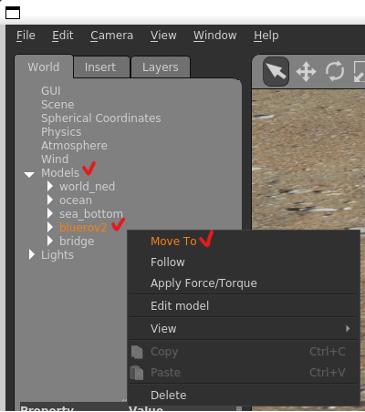
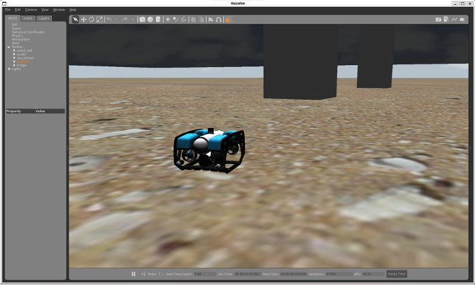
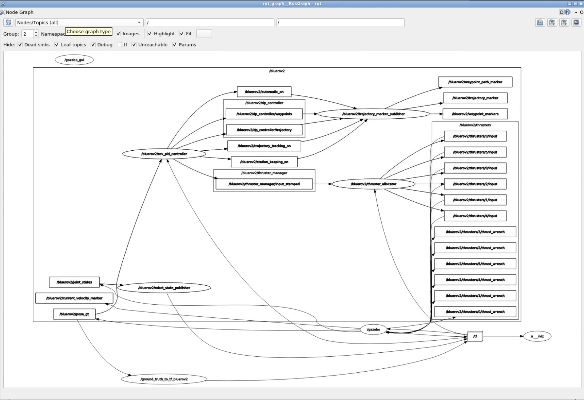
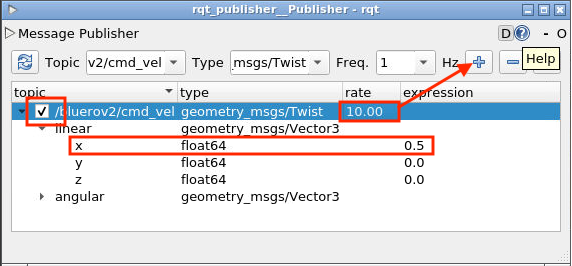
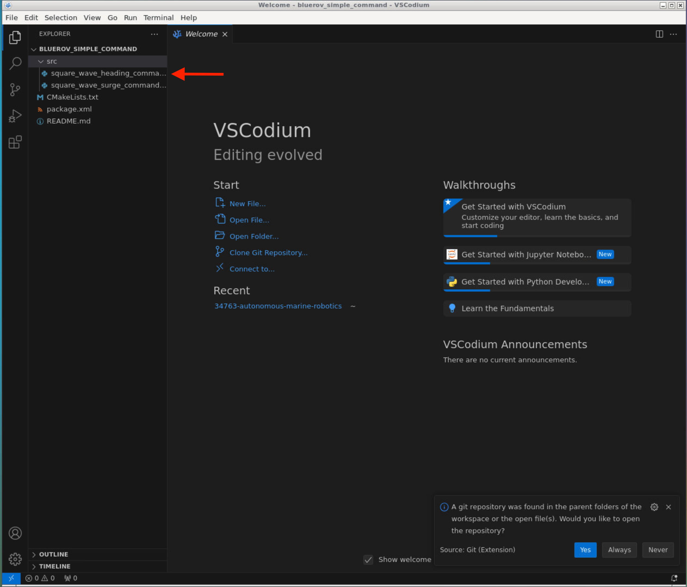
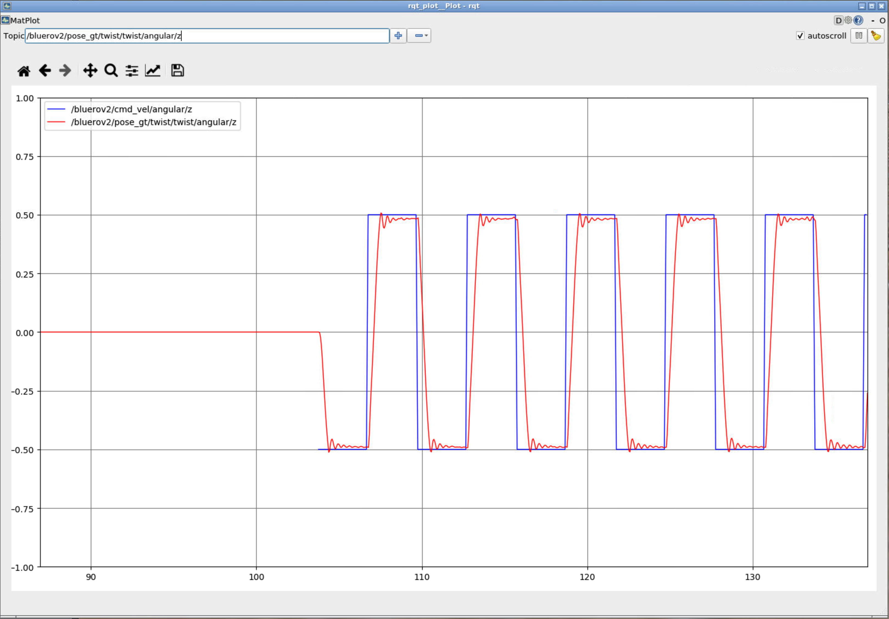
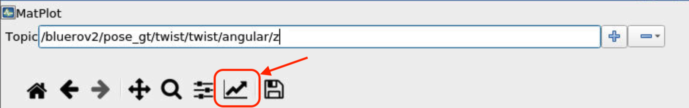

# Training Session 1 - Introduction to Simulation tool

This first exercise should familiarise you with the simulation tool, and some of the builtin-tools of ROS.

## Exercise 1 - Starting Simulation

Start the simulation framwork by opening a terminal and executing

    roslaunch bluerov2_gazebo start_pid_demo.launch

> NOTE:
> This terminal window needs to be kept open during the entire simulation

This should start two new windows 

- Gazebo: This is the physics simulator, which will also render the underwater world
- Rviz: Sensor visulation tool for ROS


In the gazebo window, focus on the robot by right-clicking the `bluerov2` model, and select `Move To` from the dropdown menu



You should now see your robot in focus like this:




### Viewing Topics

Next, open a new terminal window and type the following:

    rostopic list

This will list all the messages (topics) that are being transmitted in the system, and the output should look like this:
```bash
ubuntu@1da37dc70f79:~$ rostopic list
/bluerov2/automatic_on
/bluerov2/camera_front/camera_image/compressed
/bluerov2/cmd_vel
/bluerov2/current_velocity
/bluerov2/current_velocity_marker
/bluerov2/current_velocity_marker_array
/bluerov2/dp_controller/error
/bluerov2/dp_controller/input_trajectory
/bluerov2/dp_controller/reference
/bluerov2/dp_controller/trajectory
/bluerov2/dp_controller/waypoints
/bluerov2/gps
/bluerov2/gps/state
/bluerov2/imu
/bluerov2/imu/state
/bluerov2/interpolator_visual_markers
/bluerov2/is_submerged
/bluerov2/joint_states
/bluerov2/pose_gt
/bluerov2/pose_gt/state
/bluerov2/pressure
/bluerov2/pressure/state
/bluerov2/reference
/bluerov2/reference_marker
/bluerov2/station_keeping_on
/bluerov2/thruster_manager/input
/bluerov2/thruster_manager/input_stamped
/bluerov2/thrusters/0/dynamic_state_efficiency
/bluerov2/thrusters/0/input
/bluerov2/thrusters/0/is_on
/bluerov2/thrusters/0/thrust
/bluerov2/thrusters/0/thrust_efficiency
/bluerov2/thrusters/0/thrust_wrench
/bluerov2/thrusters/1/dynamic_state_efficiency
/bluerov2/thrusters/1/input
/bluerov2/thrusters/1/is_on
/bluerov2/thrusters/1/thrust
/bluerov2/thrusters/1/thrust_efficiency
/bluerov2/thrusters/1/thrust_wrench
/bluerov2/thrusters/2/dynamic_state_efficiency
/bluerov2/thrusters/2/input
/bluerov2/thrusters/2/is_on
/bluerov2/thrusters/2/thrust
/bluerov2/thrusters/2/thrust_efficiency
/bluerov2/thrusters/2/thrust_wrench
/bluerov2/thrusters/3/dynamic_state_efficiency
/bluerov2/thrusters/3/input
/bluerov2/thrusters/3/is_on
/bluerov2/thrusters/3/thrust
/bluerov2/thrusters/3/thrust_efficiency
/bluerov2/thrusters/3/thrust_wrench
/bluerov2/thrusters/4/dynamic_state_efficiency
/bluerov2/thrusters/4/input
/bluerov2/thrusters/4/is_on
/bluerov2/thrusters/4/thrust
/bluerov2/thrusters/4/thrust_efficiency
/bluerov2/thrusters/4/thrust_wrench
/bluerov2/thrusters/5/dynamic_state_efficiency
/bluerov2/thrusters/5/input
/bluerov2/thrusters/5/is_on
/bluerov2/thrusters/5/thrust
/bluerov2/thrusters/5/thrust_efficiency
/bluerov2/thrusters/5/thrust_wrench
/bluerov2/time_to_target
/bluerov2/trajectory_marker
/bluerov2/trajectory_tracking_on
/bluerov2/using_global_current_velocity
/bluerov2/waypoint_markers
/bluerov2/waypoint_path_marker
/clicked_point
/clock
/gazebo/link_states
/gazebo/model_states
/gazebo/parameter_descriptions
/gazebo/parameter_updates
/gazebo/performance_metrics
/gazebo/set_link_state
/gazebo/set_model_state
/ground_truth_to_tf_bluerov2/euler
/ground_truth_to_tf_bluerov2/pose
/hydrodynamics/current_velocity
/initialpose
/move_base_simple/goal
/next_point_marker
/next_point_marker_array
/occ_map
/occ_map_updates
/path
/robot_point_marker
/robot_point_marker_array
/rosout
/rosout_agg
/rviz/compressed/parameter_descriptions
/rviz/compressed/parameter_updates
/tf
/tf_static
/world_models
```

### Visualising topics
Another way to visualize the topics that are being transmitted, and also see who is send and receiving what is to use the `rqt_graph` tool.

To start the tool run  
    
    rosrun rqt_graph rqt_grap

This should open up a new window which looks like this




### Inspecting topics

To inspect a single topic run

    rostopic echo <topic_name>

The Inertial Measurement Unit (IMU) data from the BlueROV is being broadcasted as `/bluerov2/imu`, to inspect it run `rostopic echo /bluerov2/imu`

```bash
ubuntu@1da37dc70f79:~$ rostopic echo /bluerov2/imu
header: 
  seq: 62834
  stamp: 
    secs: 1257
    nsecs: 230000000
  frame_id: "bluerov2/imu_link"
orientation: 
  x: 4.841039302839003e-05
  y: -0.0001526869629930669
  z: 0.8379157948751227
  w: -0.54579950077104
orientation_covariance: [0.0001, 0.0, 0.0, 0.0, 0.0001, 0.0, 0.0, 0.0, 0.0001]
angular_velocity: 
  x: -1.2607184154297513e-16
  y: 2.8680887495450415e-16
  z: 2.7138498735917945e-14
angular_velocity_covariance: [1.1519236000000001e-07, 0.0, 0.0, 0.0, 1.1519236000000001e-07, 0.0, 0.0, 0.0, 1.1519236000000001e-07]
linear_acceleration: 
  x: 2.490445457432694e-05
  y: -0.0026679370414843346
  z: 9.79999963681043
linear_acceleration_covariance: [1.6e-05, 0.0, 0.0, 0.0, 1.6e-05, 0.0, 0.0, 0.0, 1.6e-05]
---
```

From the above you an see that the robot has
- `orientation` - the orientation of the robot w.r.t. the world frame, given as a [quaternion](https://en.wikipedia.org/wiki/Quaternion)
- `angular_velocity` - the rotational speed around the bodyframe axes (0 in this case)
- `linear_acceleration` - the acceleration in bodyframe (z = 9.79 is the gravitational vector)

## Exercise 2 - Moving the Robot

Now for some fun stuff, lets make the robot move!

### Keyboard controls

The `uuv_teleop` package contains a `uuv_keyboard_teleop.launch` file which enables keyboard controls of a specific robot (`bluerov2` in our case).

To start the keyboard control, in a terminal run

    roslaunch uuv_teleop uuv_keyboard_teleop.launch uuv_name:=bluerov2

The output should look like:

```bash
[INFO] [1708199464.534600, 0.000000]: Starting [vehicle_keyboard_teleop] node

    Control Your Vehicle!
    ---------------------------
    Moving around:
        W/S: X-Axis
        A/D: Y-Axis
        X/Z: Z-Axis

        Q/E: Yaw
        I/K: Pitch
        J/L: Roll

    Slow / Fast: 1 / 2

    CTRL-C to quit
```

Now, pressing the keys above, should make the robot move in gazebo!

### Using ROS Topics

Instead of using the keyboard, you can also publish the topics directly using the `rqt_publisher` app.

To start the application, in a terminal run 

    rosrun rqt_publisher rqt_publisher
    
Set the following parameters in the app:
- Topic: `/bluerov2/cmd_vel`
- Type: `msgs/Twist`

Set the `linear.x` value to `0.5` and check the checkbox to publish the topic.
By increasing the `rate`, you make the robot go faster.



Now try and make the robot move in another direction by modifying the `linear` or `angular` variables of the message.

### Make the Robot move using Python 

In order to make the robot move using python, you have to create a ROS node.
In the `ts1_simple_command` package located in the `/ts1_ws/src` folder, we have added a small python script which creates a ROS node and publishes messages to the `bluerov2/cmd_vel` topic.

The file `square_wave_surge_command.py` is shown below with some additional comments:

```python
#!/usr/bin/env python

import rospy
from geometry_msgs.msg import Twist
import time

def surge_publisher():
    # Initialise the ROS node with the name `square_wave_surge_command`
    rospy.init_node('square_wave_surge_command', anonymous=True)

    # Get parameters from ROS parameter server
    period = rospy.get_param('~period', 6.0)
    speed = rospy.get_param('~speed', 0.5)

    # Register as a publisher of the topic `bluerov2/cmd_vel, where the message type is a 
    # `Twist` message
    pub = rospy.Publisher('bluerov2/cmd_vel', Twist, queue_size=10)

    # Set the publishing rate of the message
    rate = rospy.Rate(10)  # 10 (Hz)

    # Make sure the node is still running
    while not rospy.is_shutdown():
        # Create a new empty Twist message, so that we can populate the individual variables
        twist_msg = Twist()
        # Set the forward (x) linear velocity
        twist_msg.linear.x = speed  # Initial linear velocity

        # Publish initial velocity for T/2 seconds
        start_time = rospy.Time.now()
        while (rospy.Time.now() - start_time).to_sec() < period/2:
            pub.publish(twist_msg)
            rate.sleep()

        # Change linear velocity to -speed
        twist_msg.linear.x = -speed

        # Publish negative velocity for T/2 seconds
        start_time = rospy.Time.now()
        while (rospy.Time.now() - start_time).to_sec() < period/2:
            pub.publish(twist_msg)
            rate.sleep()

if __name__ == '__main__':
    try:
        surge_publisher()
    except rospy.ROSInterruptException:
        pass

```

The actual file can be found at: `/home/ubuntu/34763-autonomous-marine-robotics/Training_Sessions/TS1_Introduction_to_Simulation/ts1_ws/src/ts1_simple_command/src/square_wave_surge_command.py`

#### Running the file

Now try and run the above file using the following command

    rosrun ts1_simple_command square_wave_surge_command.py

You should now see your robot move in Gazebo.


## Create your own ROS script

Now you will create your own ROS node to change the heading (`yaw`) of the robot.

First copy the `square_wave_surge_command.py` and name it `square_wave_heading_command.py` 

    cp ~/34763-autonomous-marine-robotics/Training_Sessions/TS1_Introduction_to_Simulation/ts1_ws/src/ts1_simple_command/src/square_wave_surge_command.py \
       ~/34763-autonomous-marine-robotics/Training_Sessions/TS1_Introduction_to_Simulation/ts1_ws/src/ts1_simple_command/src/square_wave_heading_command.py

Now open the folder in the VSCodium editor (open source version of Visual Studio Code) 

    codium ~/34763-autonomous-marine-robotics/Training_Sessions/TS1_Introduction_to_Simulation/ts1_ws/src/ts1_simple_command/

You should now see the entire folder structure on the left side, with the newly copied file as shown below



Open the file `square_wave_heading_command.py` and change the name of the ROS node on line 8 to

```python
rospy.init_node('square_wave_heading_command', anonymous=True)
```
Now, in order to make the robot to a heading change, we need to tell it to move around the `z` axis in body-frame, this means that you need to change the `Twist` message to have a value in the `angular.z` instead of `linear.x`, so modify the code on line 19-20 like so

```python
twist_msg = Twist()
twist_msg.angular.z = speed
```

Now that we have made a change to the code, we need to compile it our changes.
First we need to let the ros build system (`catkin`) know about our new file, in order to do so, open the `CMakeLists.txt` file in the `bluerov_simple_command/` folder, and add the `src/square_wave_heading_command.py` file to line 32, like so

```cmake
catkin_install_python(PROGRAMS src/square_wave_surge_command.py src/square_wave_heading_command.py
  DESTINATION ${CATKIN_PACKAGE_BIN_DESTINATION}
)
```
Now you can rebuild the ros workspace, by opening a terminal and navigate to the ros workspace by typing

```bash
cd ~/34763-autonomous-marine-robotics/Training_Sessions/TS1_Introduction_to_Simulation/ts1_ws/
```
from here you can build the ros packages (including our newly modified one) by typing in the terminal

```bash
 catkin_make
 ```
 Once finished you need to `source` the new compiled files, so that the system knows where to search for them
 ```
 source devel/setup.bash
 ```
 Now you can run your newly compiled ros package by executing
 ```bash
 rosrun ts1_simple_command square_wave_heading_command.py
 ```

 You should now see the robot turning in Gazebo!
Keep the terminal open - you will need it for the next part


 ## Exercise 3 - Plotting Values from ROS

 You can plot the values being published in the system by using the `rqt_plot` package.

 To plot values open a new terminal and type in the following

 ```bash
rqt_plot
```

Now in order to plot the twist message we are publishing, in the `Topic` text box type in the following

    /bluerov2/cmd_vel/angular/z

click the `+` sign to add the signal to the plot.
Too see the response of the robot, we need to visualize the "ground truth" pose, do so by adding the following signal

    /bluerov2/pose_gt/twist/twist/angular/z


Now you should see something like this:



You can modify the graph view to look like to above image by clicking the small graph icon, and adjusting the parameters to your liking.



