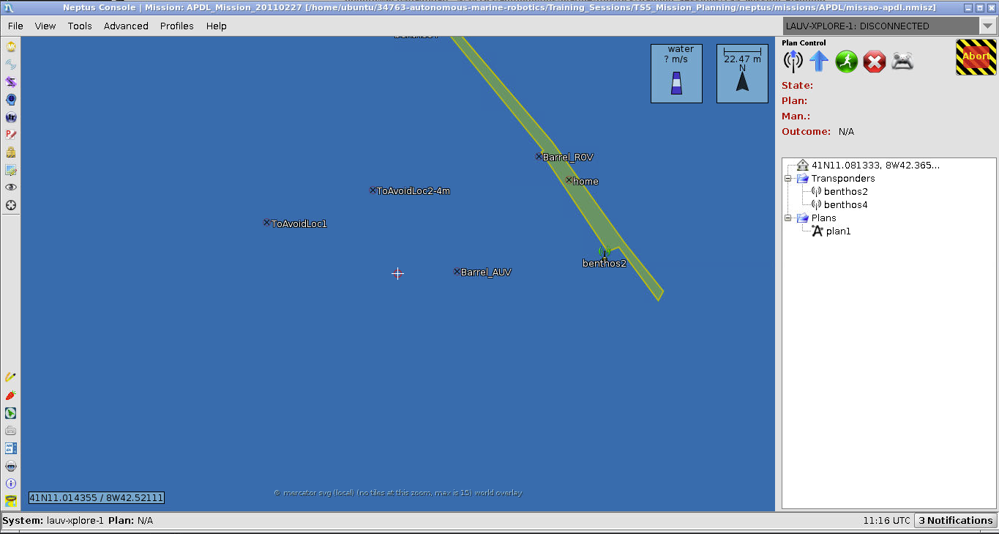
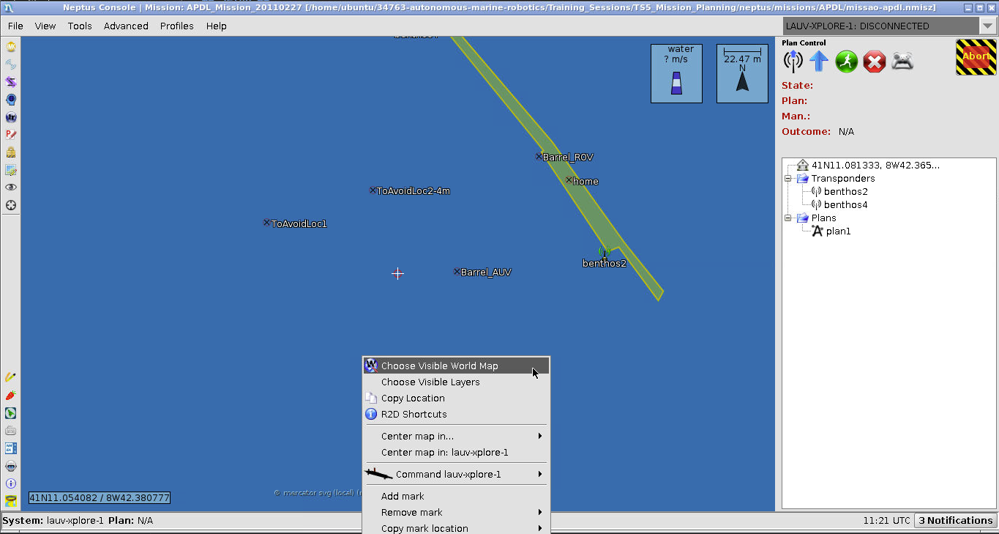
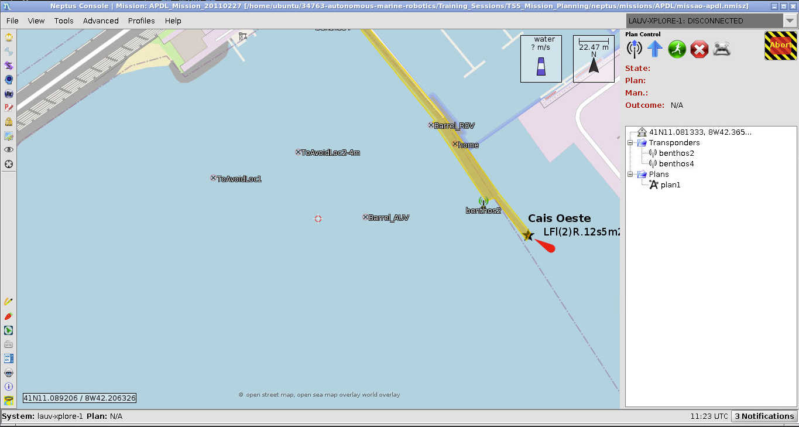
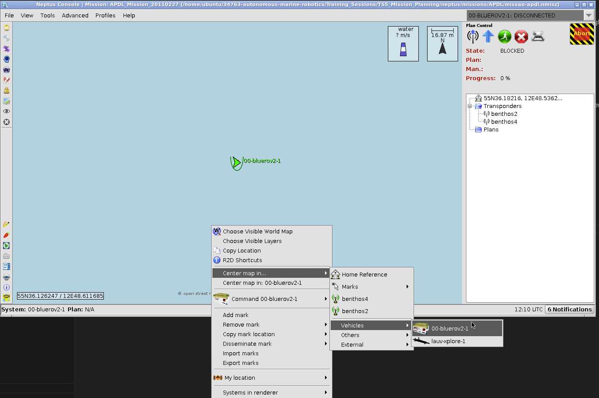
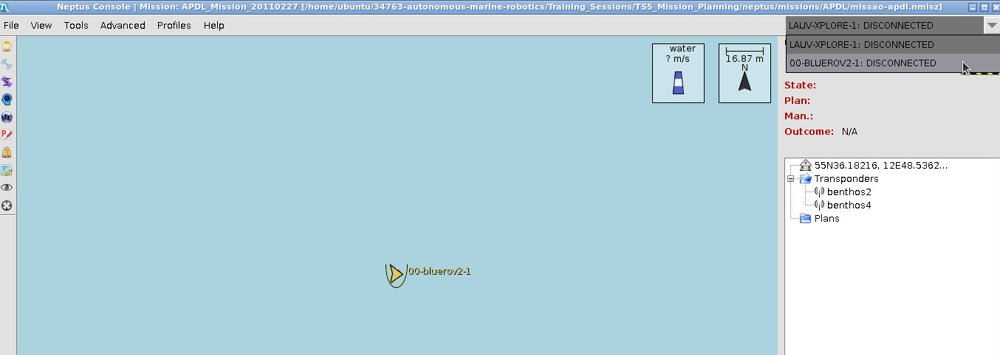

# Mission Planning Tutorial #

In this tutorial we'll integrate the simulator with an industry standard mission planning framework: [Neptus](https://github.com/LSTS/neptus).

## Pre-requisites ##

Update your docker workspace following [these instructions](https://gitlab.gbar.dtu.dk/dtu-asl/courses/34763-autonomous-marine-robotics/-/tree/main/#getting-course-updates).

## Setup ##

In your docker container workspace run the following (you should only have to run this once):

```
cd $HOME/34763-autonomous-marine-robotics/Training_Sessions/TS5_Mission_Planning
source update_ws.sh
```

## Starting Neptus ###

Neptus should have been built in the update_ws.sh script, so you should be able to run it with

```neptus```



The default console is the LAUV (Light Autonomous Underwater Vehicle) and its layout suits our purposes. Adjust the map overlay by right-clicking somewhere on the map and choosing "Choose Visible World Map":



Load in OpenStreetMap and one of the seachart layers.



The default mission is based in Portugal, first adjust the home point by right-clicking the GPS reference on the right panel 
and choosing "View/Edit Home Reference". Change latitude and longitude to 55.603036 and 12.8089368 respectively. Then right-click somewhere on the map and choose "Center map in -> Home Reference"

## ROS Nodes ##

You can launch the stack from the bluerov2_bringup package:

```
roslaunch bluerov2_bringup bringup_neptus_gazebo.launch rviz_on:=True gui_on:=False mode:=altimeter_sss
```

## Checking your system ##

With Neptus and the bluerov2_bringup stack running:

1. Right click the map and center the map on the bluerov as shown

2. Select the BlueROV as the active vehicle as shown:

3. The icon for the BlueROV2 should be green and the ROV should be facing East.

Additionally you can confirm the ROS <-> Neptus bridge is working by echoing the heartbeat:

```
rostopic echo /bluerov2/imc/imc_heartbeat
```

