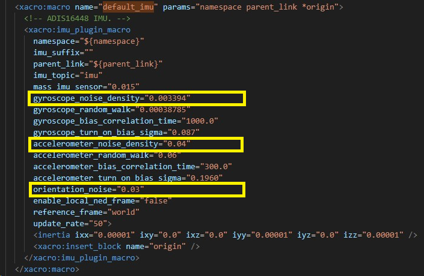

# TS6 Tutorial #

In this tutorial we'll explore how to utilize the perception system to improve robot localization.
We will compare the robot localization by only using the IMU and adding correction using AruCo markers.

What is AruCo Marker?


Localization architecture:


## Pre-requisites ##

Update your docker workspace following [these instructions](https://gitlab.gbar.dtu.dk/dtu-asl/courses/34763-autonomous-marine-robotics/-/tree/main/#getting-course-updates).

## Setup ##

In your docker container workspace run the following (you should only have to run this once):

```
cd $HOME/34763-autonomous-marine-robotics/Training_Sessions/TS6_Perception/ts6_ws
chmod +x update_ts6.sh
./update_ts6.sh
. $HOME/.bashrc
```

## Localization using IMU ###

### Start the simulator

With GUI:

```
roslaunch ts6_bluerov2_perception run.launch gui:=true fiducial_correction:=false
```

Without GUI:

```
roslaunch ts6_bluerov2_perception run.launch gui:=false fiducial_correction:=false
```

### Control the robot using keyboard:
```
roslaunch uuv_teleop uuv_keyboard_teleop.launch uuv_name:=bluerov2 
```

After controlling the robot for some time, you will notice that the estimated position will increasingly deviate from the ground truth.


#### Note on Rviz:
The red path is the ground truth position.
The green path is the estimated position.

#### Debugging:
If you got errors that contains "\r", please go to this [following guide](https://gitlab.gbar.dtu.dk/dtu-asl/courses/34763-autonomous-marine-robotics/-/tree/main/debugging.md)

## Adjusting the EKF Parameters ##

Now, it's time to fine-tune the process noise covariance value in the Extended Kalman Filter (EKF).

To do this, navigate to the IMU simulator properties located at "ros_ws/src/uuv_simulator/uuv_sensor_plugins/uuv_sensor_ros_plugins/urdf/imu_snippets.xacro":



Next, modify the ROS parameter associated with the EKF in "ts6_ws/src/ts6_bluerov2_perception/config/ekf_params_imu_only.yaml".

Configure the IMU variables to be incorporated into the final state estimate through the "imu0_config" parameter. The boolean values represent the following dimensions in order: x, y, z, roll, pitch, yaw, vx, vy, vz, vroll, vpitch, vyaw, ax, ay, az.

Currently, the IMU configuration is set to 2D:


You can adjust the process noise covariance using the "process_noise_covariance" parameter, following the same order of boolean values as mentioned above:


For more detailed information on these parameters, refer to the documentation available at this [link](https://docs.ros.org/en/melodic/api/robot_localization/html/state_estimation_nodes.html)

## Correction with AruCo markers ###

### Start the simulator
```
roslaunch ts6_bluerov2_perception run.launch gui:=false fiducial_correction:=true
```

### Control the robot using keyboard:
```
roslaunch uuv_teleop uuv_keyboard_teleop.launch uuv_name:=bluerov2 
```

Control the robot to a location where it cannot observe the AruCo markers for a period of time until the estimated position deviates. Then, guide the robot back to the area where it can detect the AruCo markers.


## Simulating in dark underwater ###


### Start the simulator
```
roslaunch ts6_bluerov2_perception run.launch gui:=false fiducial_correction:=true scenario:=dark
```

You should see that the aruco detector is not stable estimating the position of the markers.


## Extend to 3D localization ###

The current EKF setup is limited to 2D. Let's enhance it to 3D by enabling the roll, pitch, and altitude variables in the configuration file located at "ts6_ws\src\ts6_bluerov2_perception\config". Additionally, ensure to fine-tune the process noise covariance value accordingly.