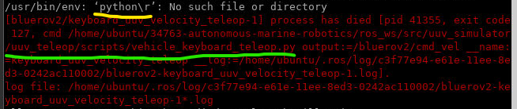

## List of errors and how to solve it

# Error in a file contains "\r"

For example:

Solution:
1. Find the related file (green underlined)
2. Open with Visual Studio Code
3. Click CRLF at the bottom right of Visual Studio Code
4. Change it to LF
5. Save