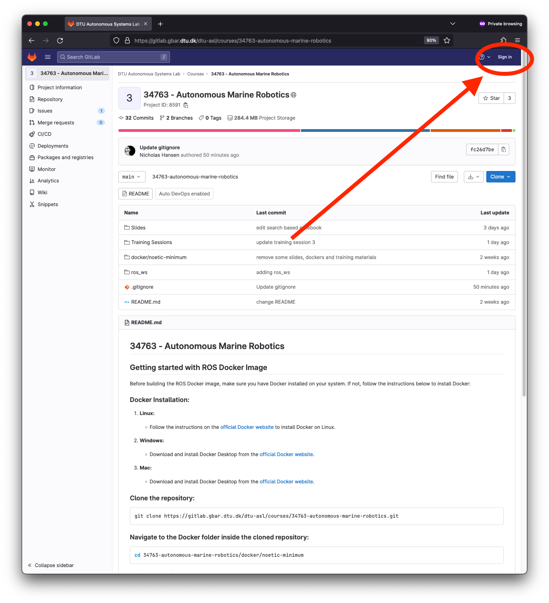
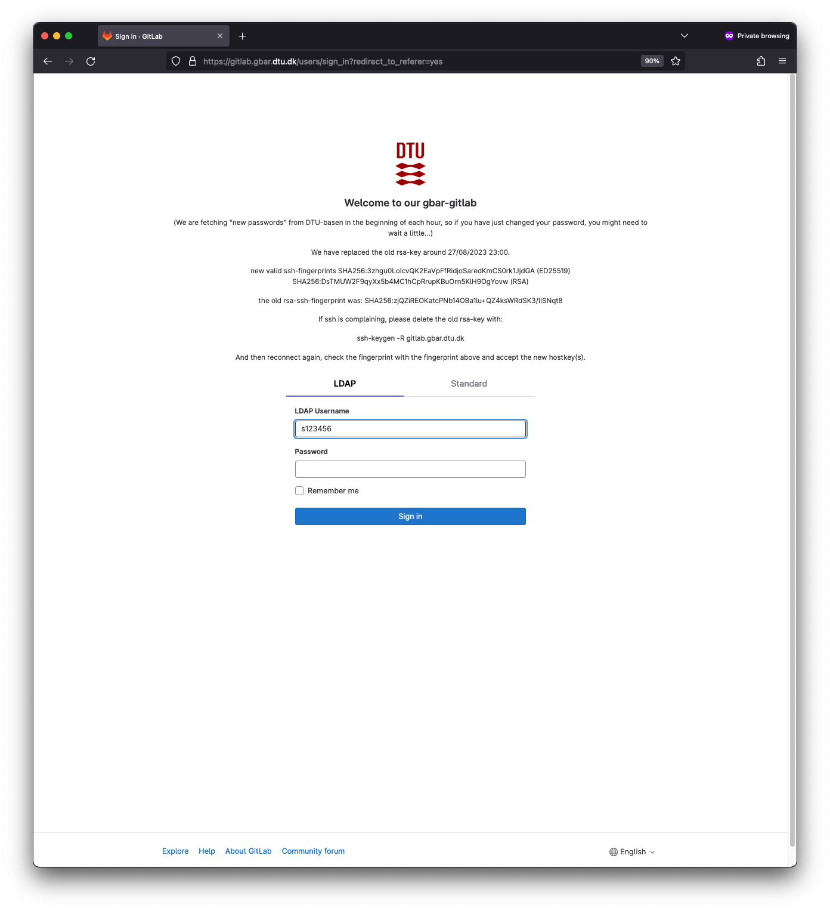
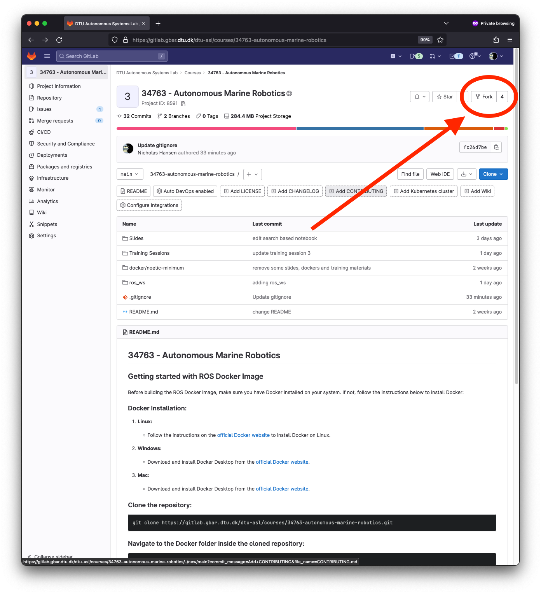
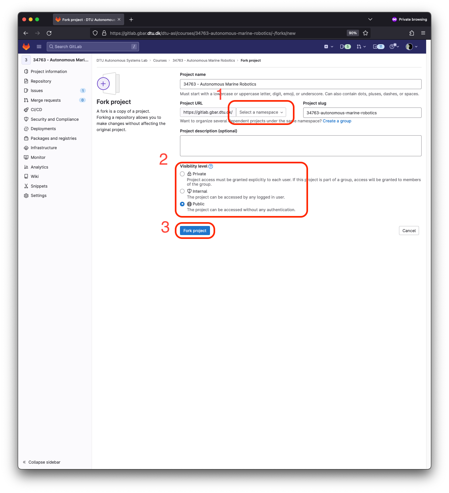
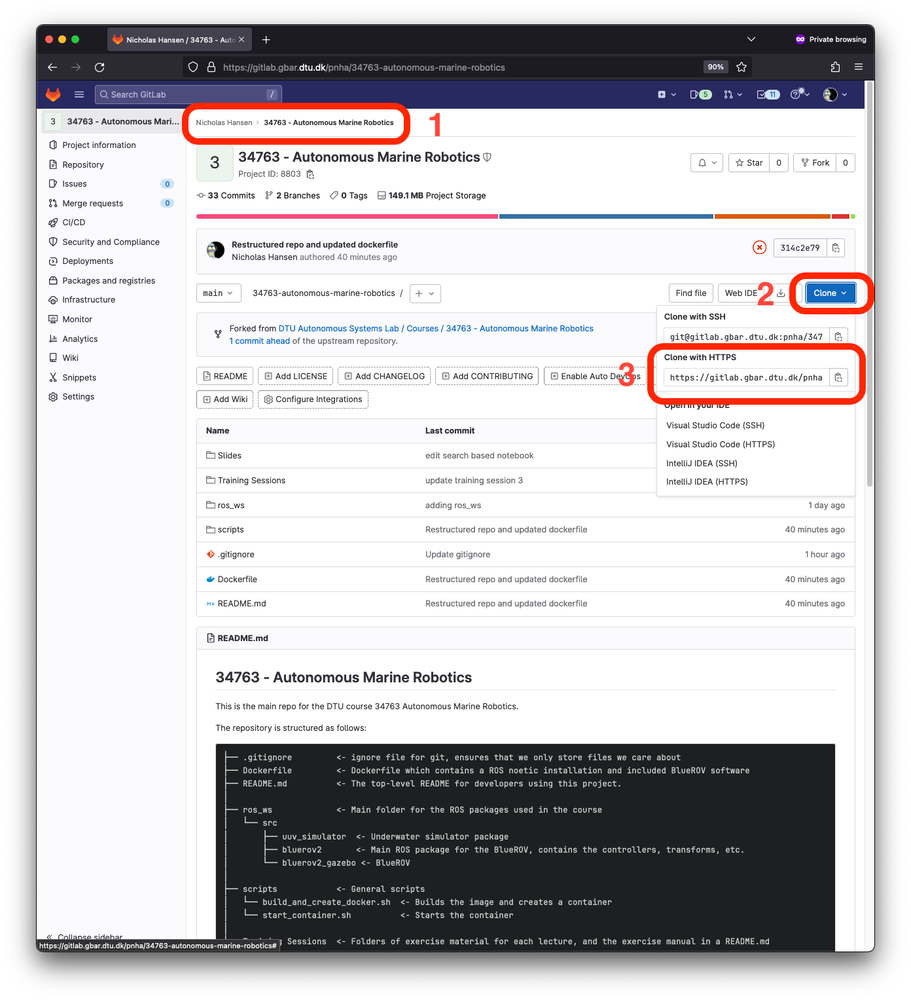

# Uploading your changes to Gitlab

In order to save your changes you done, you can create a fork of this repo.
All this essetially means is that you make a personal copy of the repository, which is your own personal sandbox.

This allows you to upload the changes and code you will be developing during the course, from inside the docker container to gitlab.

<!-- > IMPORTANT!  
> The first steps can be performed *OUTSIDE* of the container, i.e. your browser.   
> You will be instructed when to switch to the container -->

In order to fork, you must sign into the DTU gitlab, do this by clicking here:



Now login with your DTU credentials, i.e., username is your student number (for example`s123456`) and password is your normal password (same as learn, inside, etc.).



Now you should see the `fork` button in the upper right corner



By clicking that you should now be presented with the following page



Here you must

1. Select your student number as namespace using the dropdown menu
2. Select the visibility level you want (public = anyone in the world can see, private = only you can see it)
3. Press `Fork project` to finish the process

You will then be presented with this screen (notice that the project is now located at `<student number> > 34763 - Autonomous Marine Robotics)



Here you should

1. Notice that the repository is now located at `<studentnumber> > 34763 - Autonomous Marine Robotics`
2. Press the `Clone` button
3. Copy the `Clone with HTTPS` url into a text editor 

## Adding your repository to git 
<!-- 
> IMPORTANT!  
> The following steps **MUST** be performed inside the container -->

Open a terminal and navigate to the course folder
```bash
cd ~/34763-autonomous-marine-robotics
```
Now you can add the `url` to your forked version of the repo by running the following

```bash
git remote add personal_repo <url>
```

where the `<url>` is the url you copied earlier.


## Uploading your changes

Now any changes you make to the repo can be added to your own personal fork of the repo by running the following commands (ignore everything from the `#` and afterwards.)

```bash
git add . # <-- this add ALL your changes in the repo to be versioned (saved)
git commit -m "Saving my changes" # <-- this is adds a comment to your changes
git push personal_repo main  # <-- This pushes your changes to your forked repo
```

There is also a small script in the `scripts/` folder that does this for you

```bash
./scripts/save_my_changes.sh
```

When prompted, fill in your username and password.