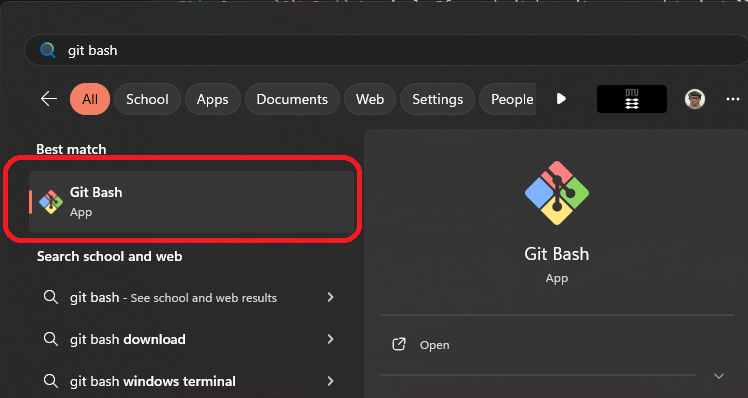
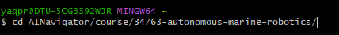
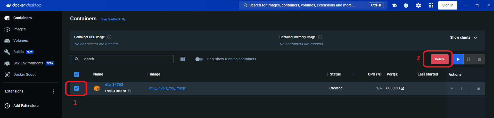

## Building on Windows

### Step 1 - Open the Git Bash Terminal

Open a `Git Bash` terminal. If you don't have it, you need to install it from [here](https://git-scm.com/downloads).



Go to where you clone the repository:
```bash
cd <parent folder>/34763-autonomous-marine-robotics
```

For example:


### Step 2 - Run the script

Run the script:
```bash
sh scripts/windows_build_and_create_docker.sh
```

### Step 3 - Just in case the building process failed

The building process may be failed if you have the container created before. To solve that, you need to remove it. 

As you are not removing the docker image, the docker re-building and re-creating process will not be as long as the first time :smiley:

You should remove the container by the Docker Desktop:




Then re-run the script as in step 2.
